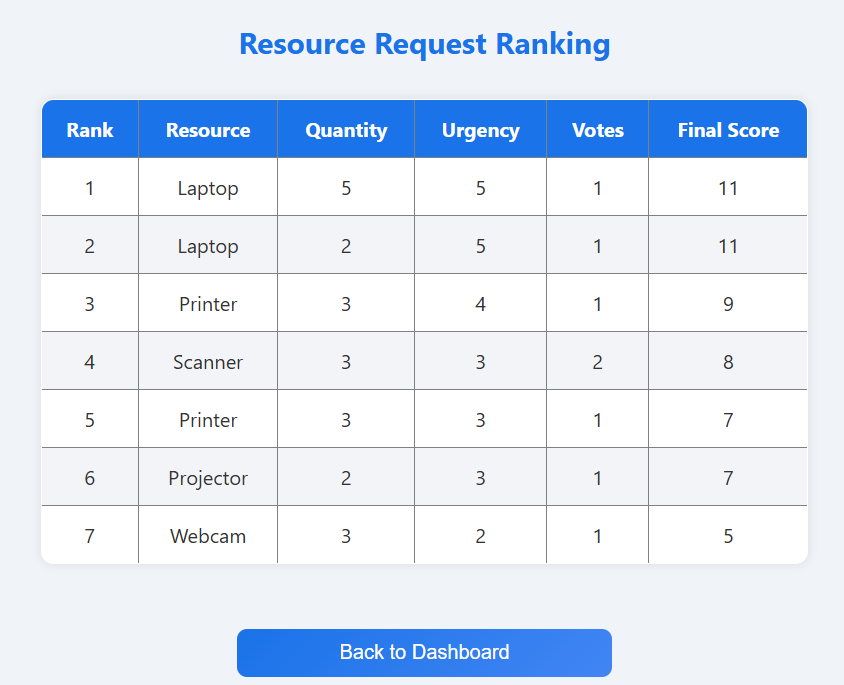
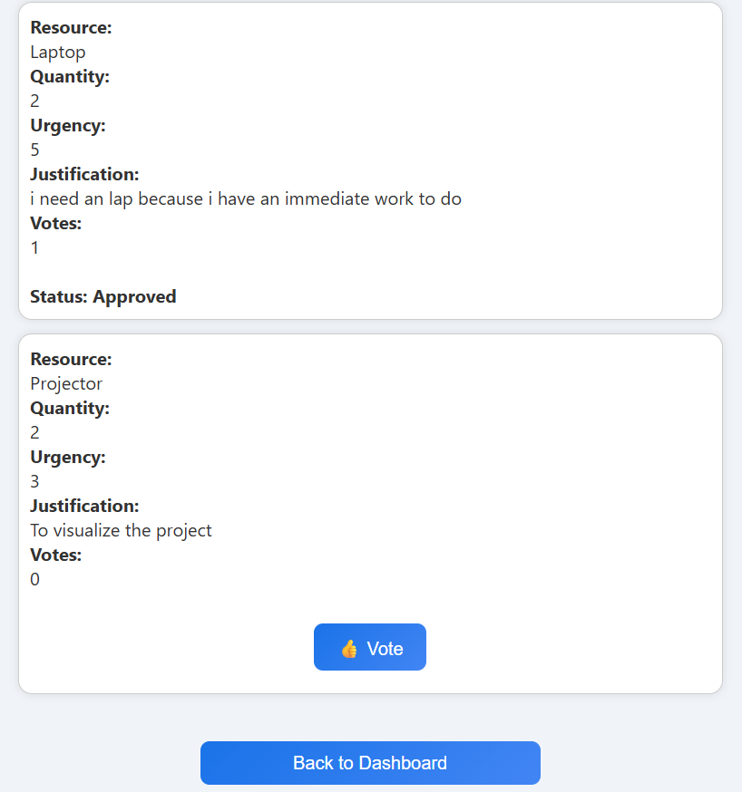

PROJECT TITLE:

CROWD_SOURCED RESOURCE ALLOCATION TOOL

PROJECT OVERVIEW:

The Crowd-Sourced Lab Equipment Allocation System is a web-based application built to manage the fair and transparent distribution of limited laboratory equipment in a college environment.

In many academic institutions, multiple students often request the same lab equipment at the same time. This usually leads to conflicts, delays, or manual decision-making that may not always be fair. This project aims to solve that problem by introducing a community-driven approach to prioritizing resource requests.

Students can submit requests for lab equipment by providing details such as the required item, quantity, urgency level, and a brief justification. Once submitted, these requests are visible to other students in the system. The student community can then upvote or downvote requests based on how important or urgent they believe each request is.

The system combines community votes, urgency levels, and predefined logic to calculate a final priority score for every request. All requests are displayed on a ranking page, sorted according to this score, making the decision-making process clear and transparent.

The admin (lab in-charge)uses this ranked list to allocate available equipment efficiently. The system keeps track of resource availability and automatically updates the allocation status of each request.

By blending student input, community feedback, and algorithm-based ranking, the system reduces bias, improves fairness, and provides a practical digital solution for managing lab resources in an academic setting.

PROJECT FLOW:

1. Student submits request

2. Request stored as pending

3. Community votes

4. Final score calculated

5. Requests ranked

6. Admin allocates resources

TECH STACK:

Frontend: React

Backend: Node.js + Express

Database: MongoDB Atlas

Auth: JWT

Version control: Git + GitHub

SCREENSHOTS

